CS464 Assignment 01 Muhammad Tayyab BSSE23018

## Game 1 Earn to Die
**Store link:** [Insert your Google Play/App Store link here]
**Genre:** 2D Physics Driving / Survival
**I played:** For 45 minutes, unlocking the second vehicle and reaching day 12.

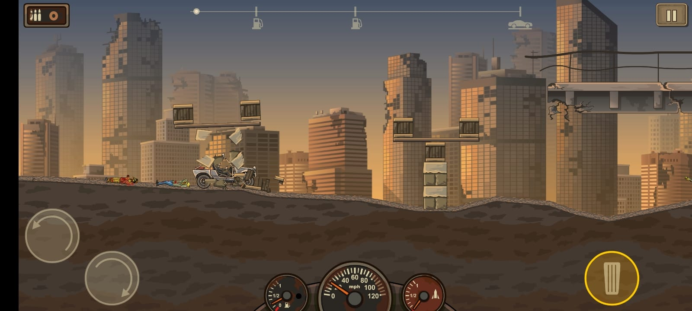
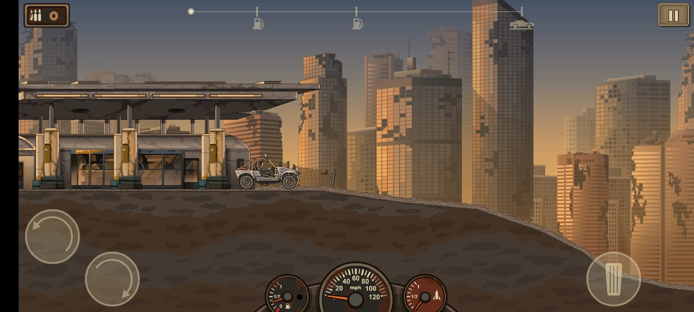
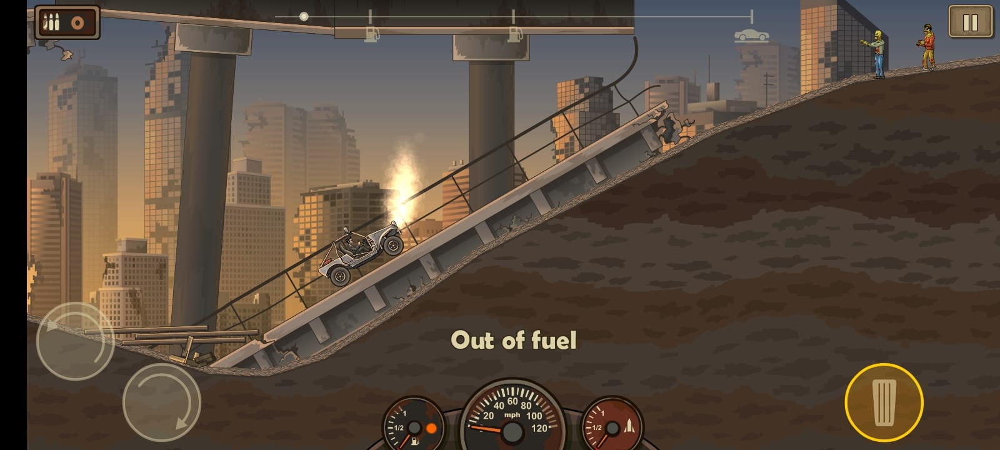

1. [M2, M5] The vehicle plows through zombies, demonstrating collision drag (M2) while earning cash bounties per kill (M5).
2. [M1, M3] The vehicle is stranded on an incline after the 'Out of fuel' fail state triggers (M1), showing pitch control limitations on steep terrain (M3).
3. [M7] The vehicle passes a structural checkpoint, navigating uneven terrain that tests suspension and momentum (M7).
 
| Mechanic | Dynamic | Aesthetic | Bartle type |
|---|---|---|---|
| M1: Fuel continuously drains while accelerating; running out ends forward momentum. | Players burst-fire acceleration mid-air to conserve gas for flat ground. | Challenge | Achiever |
| M2: Striking zombies reduces vehicle velocity based on vehicle mass. | Players upgrade front bumpers first to maintain speed through thick crowds. | Sensation | Achiever |
| M3: Left/right tilt controls rotate the vehicle's pitch mid-air. | Players adjust pitch to match landing slopes, retaining forward momentum upon impact. | Sensation | Explorer |
| M4: Nitrous boost provides a secondary, finite burst of high linear force. | Players save boost exclusively for steep hills to avoid stalling. | Challenge | Achiever |
| M5: Distance traveled and zombies crushed convert directly to currency post-run. | Players grind repetitive, short runs solely to afford the next engine upgrade. | Submission | Achiever |
| M6: Upgrading fuel capacity increases the maximum starting volume by a fixed percentage. | Players prioritize fuel above all else to reach further geographical milestones. | Discovery | Explorer |
| M7: Landing upside down damages the chassis and instantly ends the run. | Players play cautiously on large jumps to avoid run-ending flips. | Challenge | Explorer |

**Aesthetic profile:** Challenge and Submission lead. Challenge arises from optimizing physics and fuel management on difficult terrain, while Submission keeps players returning to habitually grind out the next incremental upgrade.

**Player types**
Primary: Achievers (acting on world), because the entire loop revolves around maximizing distance and upgrading vehicle tiers (M1, M5).
Secondary: Explorers (interacting with world), because players must learn the terrain layout and experiment with physics balance (M3, M7).

## Game 2 F18 Flight Simulator
**Store link:** [Insert your Google Play/App Store link here]
**Genre:** 3D Flight Simulation
**I played:** For 35 minutes, attempting 10 carrier landings and completing the basic flight tutorial.

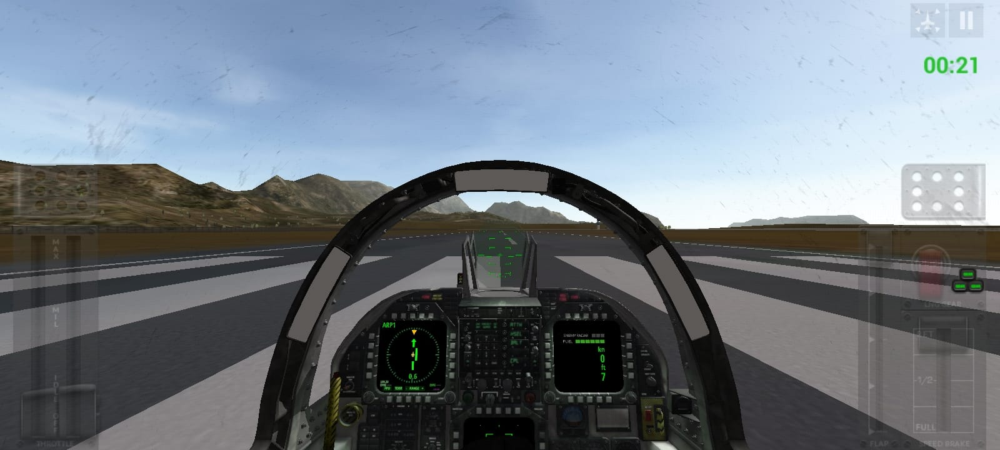
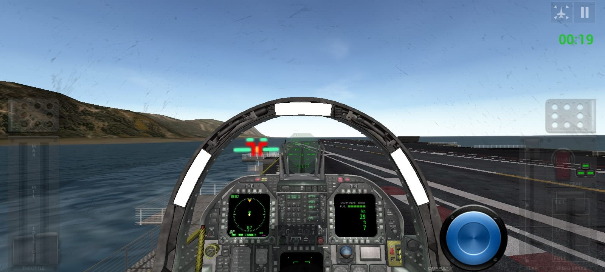
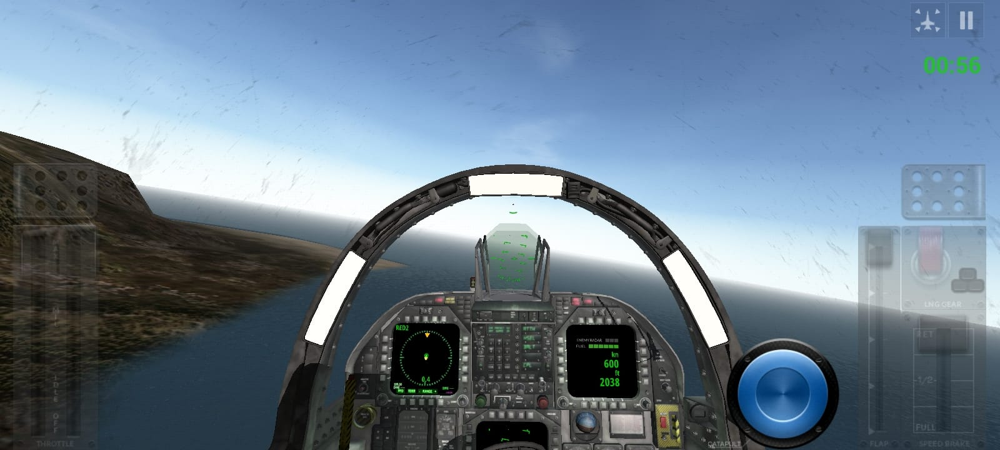

1. [M4, M6] HUD view showing the glide slope indicators aligning the jet with the carrier deck (M6) to catch the arresting wires (M4).
2. [M2, M5] Cockpit view flying at 600 knots, showing the throttle slider (M2) set to high and landing gear safely retracted (M5).
3. [M2, M7] Successful touchdown on the carrier deck, with throttle at idle (M2) and speed at 0 knots after a safe vertical descent (M7).

| Mechanic | Dynamic | Aesthetic | Bartle type |
|---|---|---|---|
| M1: Airspeed dropping below the stall threshold removes lift and pitch control. | Players constantly monitor airspeed on approach, adding throttle if they sink too fast. | Challenge | Explorer |
| M2: Throttle slider controls engine output, directly affecting acceleration and fuel burn. | Players make microscopic adjustments to maintain an exact, stable approach speed. | Sensation | Explorer |
| M3: Deploying flaps increases low-speed lift but adds heavy forward drag. | Players drop flaps just before landing to maintain control at low speeds without stalling. | Discovery | Explorer |
| M4: Arresting hook catches carrier cables only if touchdown occurs within the designated wire trap zone. | Players memorize the visual sight picture of the deck to hit the exact three-wire. | Challenge | Achiever |
| M5: Deploying landing gear above maximum structural speed limits causes mechanical failure. | Players aggressively air-brake before lowering gear to prevent instant failure. | Challenge | Achiever |
| M6: HUD indicators display vertical and lateral deviation from the target glide slope. | Players fixate on the crosshairs, constantly correcting drift before crossing the deck threshold. | Challenge | Achiever |
| M7: Vertical descent rate exceeding structural limits upon touchdown triggers a crash fail state. | Players aggressively flair the nose up at the last second to soften the impact. | Sensation | Explorer |

**Aesthetic profile:** Challenge and Sensation lead. Challenge comes from the unforgiving tolerances of naval aviation and landing, while Sensation comes from the audio-visual feedback of speed, altitude, and mechanical systems.

**Player types**
Primary: Explorers (interacting with world), because mastering the complex cockpit instruments and aerodynamic flight physics is the core activity (M1, M2, M3).
Secondary: Achievers (acting on world), because landing on the wire is a strict pass/fail test to conquer and grade (M4, M6).

## Level blockouts

| Level | Screenshot | Its idea | Wayfinding tool |
|---|---|---|---|
| Level01 | 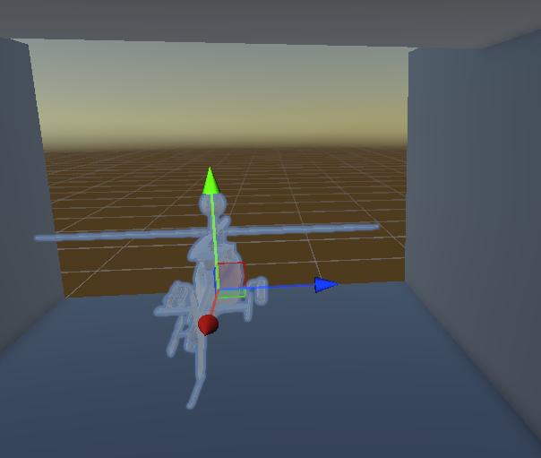 | A linear gauntlet introducing ramps and pushable low cover. | Framing: The long tunnel physically restricts the view, focusing the player directly on the goal. |
| Level02 | 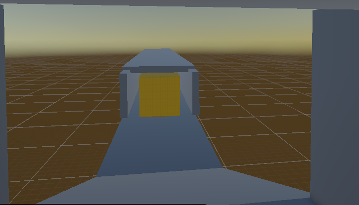 | A tight choke point forcing interaction with a central blocking obstacle. | Pinch and release: The narrow tunnel restricts movement before opening up to the rest of the track. |
| Level03 | 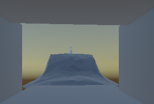 | A steep vertical elevation climb requiring built-up momentum. | Landmark: The goal marker sits at the very peak, visible from the bottom of the ramp. |
| Level04 | 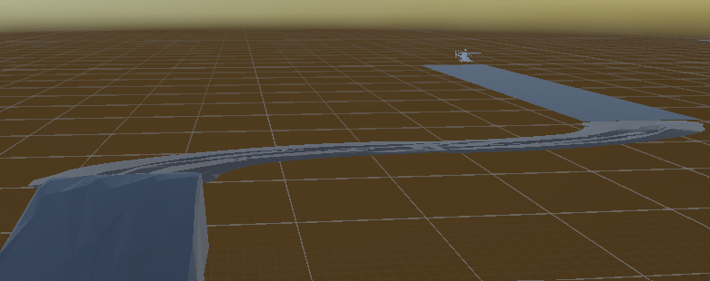 | A curved, elevated pathway testing lateral movement and cornering. | Leading lines: The physical curve of the track naturally draws the eye toward the final destination. |
| Level05 | 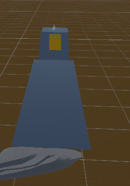 | A long straightaway concluding in a sudden blind drop-off gap. | Light and contrast: The brightly colored backing on the goal stands out against the empty skybox. |